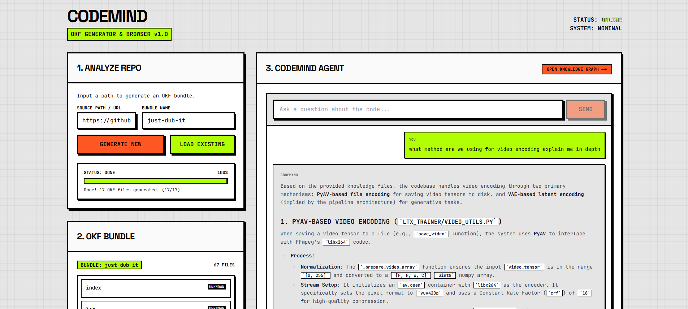
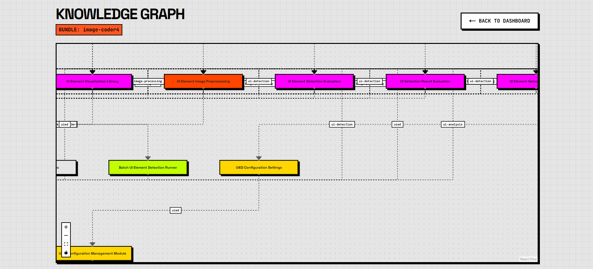

# CodeMind: Open Knowledge Format (OKF) Engine



Modern codebases are massive, highly decoupled, and increasingly difficult to navigate. Standard AI developer tools rely on blind vector search, retrieving isolated snippets without understanding the underlying architecture. 

**CodeMind** solves this by introducing the **Open Knowledge Format (OKF)**—a deterministic pipeline that transforms any raw repository into a structured, relational knowledge graph.

By parsing Abstract Syntax Trees (ASTs) and generating hierarchical metadata before a single LLM prompt is sent, CodeMind creates a deterministic map of your codebase. This allows developers to query their architecture with perfect structural context, eliminating AI hallucinations and context window bloat.

---

## 🏗 System Architecture

CodeMind is divided into two highly optimized, decoupled services.

### 1. The Knowledge Producer (FastAPI Backend)
The backend is a high-throughput processing engine responsible for parsing and packaging repositories.

*   **AST Extraction:** Uses static analysis to extract function signatures, class definitions, docstrings, and imports without expensive LLM token consumption.
*   **OKF Bundling:** Generates standardized YAML-frontmatter Markdown files (`.okf` models) representing discrete modules, APIs, and architectural concepts.
*   **Relational Graphing:** Computes Jaccard similarity across metadata tags to map hard dependencies and conceptual relationships across the codebase.
*   **Deep RAG Retrieval:** An intelligent Selective Retriever that dynamically fetches high-level module summaries and, when required, injects raw source code directly into the context window for deep mathematical and algorithmic analysis.

### 2. The Interaction Layer (Next.js Frontend)
A high-performance React client built with a strict Neo-Brutalist design system.

*   **Real-time Processing Pipeline:** Streamed server-sent events provide live updates as the backend crawls, parses, and summarizes large repositories.
*   **Knowledge Graph Visualizer:** A fully interactive, force-directed architectural map rendered via React Flow. Nodes represent distinct files, while edges visualize dependencies, allowing developers to visually traverse their system.
*   **Context-Aware Chat:** A specialized chat interface that pairs developer queries with precise RAG retrieval. The UI enforces strict transparency, explicitly listing every file scanned and token consumed to generate the answer.

---

## 🕸 The Knowledge Graph



The OKF pipeline automatically maps your repository into a visual dependency graph. 

Instead of reading raw directories, the Knowledge Graph organizes nodes by functional category (API, Module, Config, Architecture). Directed edges represent conceptual and programmatic links between modules, allowing new developers to instantly visualize the flow of data and dependencies across an unfamiliar system.

---

## ⚙️ Tech Stack

*   **Backend:** Python 3.12, FastAPI, Pydantic, Uvicorn, YAML Frontmatter
*   **Frontend:** Next.js 14, React 18, Tailwind CSS (Custom Brutalist Theme), React Flow, Framer Motion
*   **AI Engine:** Google Gemini (1.5 Flash), Token-Optimized RAG Pipeline

---

## 🚀 Getting Started

### 1. Start the OKF Backend
```bash
cd backend
pip install -r requirements.txt
uvicorn main:app --reload --port 8000
```

### 2. Start the Client Interface
```bash
cd frontend
npm install
npm run dev
```

Navigate to `http://localhost:3000` to begin parsing your first repository.
